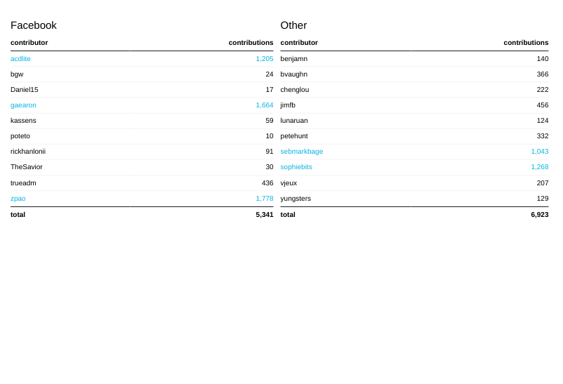

# Refactoring Workshop 2022

This is my solution to this [repo](https://github.com/gauthierm/refactoring-workshop-2022). I have done a lot of revisions of various functions and components. Some ambiguity in the directions has changed my implementation in some slight ways. Various implementation design choices are listed in the [Thoughts](#thoughts) section. The screenshot is what you get when you first run the application and my implementation gives the same output.

## Screenshot



# How to Use

Clone this repo to your local machine:

```sh
git clone https://github.com/jdegand/refactoring-workshop-2022.git
cd refactoring-workshop-2022
```

Install project dependencies:

```
npm install
```

Start the server:

```
npm start
```

Visit the workshop page:

http://localhost:5000/

# The App

The app is an Express server that does a couple of things:

1. Simulate the GitHub REST API for the Facebook React project. The API is simulated to allow development without hitting API limits.
2. Display some aggregated data based on the API. Data is displayed using server-side React.

The second item (displaying data from the API) is where we will focus in today's workshop.

# Requirements

### 1. Split file `getPageContent.tsx` into smaller individual component functions

- getNextPage
- getContributors
- getMembers
- getGroupedMemberData

### 2. Clean up `getNextPage()` using a declarative approach

- write test cases in `getNextPage.test.ts`
- use map + filter
- remove let declaration

### 3. clean up pagination, using a generic approach

The `getMembers()` and `getContributors()` functions have an almost identical
program flow. Let’s collect that flow into a new function called `getData()`
so we are not repeating ourselves twice. This way we can write tests for the
implementation once.

- make a `getData(url: string): Promise<any[]>` function
- use array concat operator instead of push in a loop
- use the new generic pagination routine in getContributors and getMembers

### 4. Inject dependencies for `getContributors()` and `getMembers()` functions

Right now the contributor and member functions do both loading the data and
manipulating the data to build a result.

- update functions to receive the data as a parameter
- now we can easily write a tests for them

### 5. use declarative approach for `getContributors()` and `getMembers()`

- we are conditionally including values in our result, this can be replaced with a filter function
- we are returning a new array with modified values. This can be replaced with a map function

### 6. Write an `isUser()` function

We use the same logic to check for bots in both places. We can extract this to
a reusable function with its own tests.

- write isUser()
- write tests
- update getContributors and getMembers to use new function

### 7. inject dependencies for `getGroupedMemberData()` data

This function uses the contributor list and member list to get the data for the
page. Right now, the other functions are called in the implementation of this
function. This makes it more difficult to test or refactor.

Instead, we can pass the required data to the function as parameters. This will
allow us to easily pass in mock data in tests. It is a better design that
reduces the dependencies between functions.

- update `getGroupedMemberData()` to `getGroupedMemberData(contributors: any[], members: any[])`
- it no longer needs to be async and can be a pure function
- write a test cast for the new function

### 8. Use a more declarative approach for `getGroupedMemberData()`

The function is still using array push running totals and are using a
conditional to filter data inside a forEach.

If there were more than two groups, the approach might be different.

- use a reducer function to partition the array into facebook & non-facebook data
- use an object map and a reducer to get grouped totals

### 9. Split `getGroupedMemberData()` into discrete functions.

The `getGroupedMembers()` function is doing data aggregation, data partitioning
sorting, etc. Splitting it into single-purpose functions will make the code
cleaner and easier to understand and test.

- split by steps: grouping data, totalling data, cleanup for display
- create `getContributorsByOrganization(contributors: any[], members: any[])` to partition data
- create `getTotalContribututionsByOrganization(groupedContributors: { [key: string]: any[] })` to get totals
- create `getContributorsToDisplay(groupedContributors: { [key: string]: any[] })` to sort and truncate data
- use the new functions in `getPageContent()`
- update tests

### 10. Update `getContributorsToDisplay()` to not mutate input

Sorting and splicing in JavaScript are in-place functions and will modify the
input value. This side-effect could unintentionall impact the code in the
calling context.

- use slice instead of splice to create a copy of the array
- clean up repeated code while we're at it usign an object-map

### 11. Use TypeScript generics with `getData()`

The `getData()` function returns an array of `any` type. We can take advantage of TypeScript generics and have it return a known type that we specify.

- update the signature to be `getData<T>(): Promise<T[]>`
- make `Contributor` and `Member` interfaces for our data
- cast the `json()` calls in `getData()` to the type `T`
- when calling `getData()`, pass in the generic type like `getData<Contributor>(...)`
- update other functions that use the data to use the interfaces

### 12. Add run-time data validation

If GitHub changes their response format, we'll have unexpected unhandled errors.

- use Zod to make run-time validated interfaces
- update getData `getData<T extends z.ZodTypeAny>(schema: T): Promise<Array<z.infer<T>>>`
- use `schema.parse()` to validate data rows in `getData()`
- use `z.infer` to redefine our existing interfaces for `Contributor` and `Member`

### 13. Parallelize promise calls.

The `getContributors()` and `getMember()` function do not depend on each other so we can call them in parallel.

- Use Promise.all and array destructuring to call both APIs at the same time.

### 14. Next steps

The React code in `components` has similar issues. Can it be cleaned up in the same way? Remember that files with JSX need the extension `.tsx`.

- Should there be more components created?
- Better TypeScript interfaces?
- Declarative approach?
- Tests?

## Takeaways

**Reduce scope of individual files.** We've decomposed the original file into several smaller files that are easier to understand.

**Add tests** to catch bugs and enable refactoring. We've added a whole bunch of great tests as we split up and improved our code.

**Make functions do one thing.** Several functions were doing multiple things. If we can make them do one thing, it makes testing easier and makes implementations simpler.

**Lift dependencies higher** in your code and pass them in as function arguments. This helps you write code that is easier to read and easier to test.

**When you see state mutation, be wary.** Look out for let, push, forEach, sort, slice, += and other mutation operators in JavaScript. When values are mutated, there is more opportunity for untentional side-effects.

**TypeScript is great** and we can use it to write code that is safe and flexible.

**Think about how your code will be tested**. If you can test it easily, it's probably well designed.

## Thoughts

- Did not want to upgrade my node (or install another version of node) to specified version so I eliminated engine declaration in package.json
- App did not work on first startup - replaceAll needed to be *replace* in getNextPage function of getPageContent.tsx & key issue in Stats.tsx
- Can't use react dev tools extension when passing react to ejs template - key problem harder to solve without being able to inspect
- This implementation eliminated a lot of react code bloat but it has drawbacks
- Used index to fix key problem - each table needs a unique key and each row needs a unique key - could use uuid or nanoid 
- Nanoid has conflicts with typescript 
- Headers not mentioned in directions for #3 - getData() needs to pass back the headers as well - otherwise you'd need to make the same api request twice
- Unless headers are not needed - doesn't seem like pagination is implemented and you are not able to click to get different groups of 10 facebook / nonfacebook contributors
- getData has a different return type than directions expect (bc of headers) so converting to typescript generic - more involved?
- Created utils folder to store refactored code - they could be placed in components folder but they don't return any jsx
- when refactoring getGroupedMemberData -  I brought in the smaller functions and used them to see if everything still worked
- Tests failed when I used `groupedMembers = await getContributorsByOrganization(contributors, members)` - the result of facebook array had duplicated value - bug in getContributorsByOrganization ? - or does data contain a duplicated entry ?
- getContributorsByOrganization uses includes() so if data is duplicated - it will be added to the array
- No, result was caused by `groupedMembers.facebook.push(contributor)` in contributors.forEach function.  Need to comment out when testing getGroupedMemeberData if having groupedMembers be the result of call to getContributorsByOrganization
- If you were to use getTotalContribututionsByOrganization inside getGroupedMemberData, you would need to comment out the pushes to totals in the forEach.
- getTotalContribututionsByOrganization is spelled wrong - if you correct spelling, tsconfig.json gives an error - so I guess it's best to leave it as is and note it here - tslint is looking for test files with both correct and incorrect spellings - so I duplicated file in tests folder - bizarre error and have not looked further into the issue
- getGroupedMemberData still mutates data - I thought about refactoring it but it is not used anymore in the application.   
- getPageContent needs a test ?
- Stats.tsx and Row.tsx are testable - need to install react-test-renderer or react-testing-library - can do a basic snapshot test since component should not change 
- forEach breaks typescript - since you can mutate shape of data - typescript will look for properties that no longer exist ie forEach call in getContributors
- Directions make it seem like converting to declarative approach is for performance or maintainability but it is necessary for the typescript - you can't mutate data.  Typescript will throw errors and the app will not work.  
- Member interface is same as contributor except it needs a contributions property
- Never used Zod before this project - Zod saves on code duplication with z.infer and makes declaring types easy  

## Useful Resources

- [Blog](https://bobbyhadz.com/blog/typescript-get-return-type-of-promise) - typescript return type of promise
- [Blog](https://bobbyhadz.com/blog/react-typescript-pass-function-as-prop) - pass function as prop
- [Blog](https://notes.alexkehayias.com/gracefully-fetch-api-data-with-react-and-typescript/) - gracefully fetch api data with react and typescript
- [LogRocket Blog](https://blog.logrocket.com/how-to-pass-typescript-function-parameter/) - pass typescript function parameter
- [TutorialsPoint](https://www.tutorialspoint.com/typescript/typescript_multi_dimensional_arrays.htm) - typescript multi-dimensional arrays
- [Typescript docs (old)](https://www.typescriptlang.org/docs/handbook/functions.html) - typescript handbook functions
- [Stack Exchange](https://codereview.stackexchange.com/questions/162878/partitioning-an-array-based-on-a-condition-in-javascript) - partitioning an array based on condition
- [24ways](https://24ways.org/2019/five-interesting-ways-to-use-array-reduce/) - five interesting ways to use array reduce
- [Stack Overflow](https://stackoverflow.com/questions/15748656/javascript-reduce-on-object) - reduce on object
- [Stack Overflow](https://stackoverflow.com/questions/50249604/create-map-to-reduce-javascript) - create map to reduce
- [Stack Overflow](https://stackoverflow.com/questions/64188099/how-to-reduce-array-of-objects-into-one-object) - reduce an array of objects into one object
- [Stack Overflow](https://stackoverflow.com/questions/14810506/map-function-for-objects-instead-of-arrays) - map function for objects instead of arrays
- [Stack Overflow](https://stackoverflow.com/questions/8837454/sort-array-of-objects-by-single-key-with-date-value) - sort is not immutable?
- [YouTube](https://www.youtube.com/watch?v=laP1gML83DA) - Write better JavaScript code | JS Best Practices (Promise.all/Destructuring)
- [UUID generator](https://www.uuidgenerator.net/dev-corner/typescript) - uuid with typescript
- [Blog](https://dpericich.medium.com/how-to-build-multi-type-multidimensional-arrays-in-typescript-a9550c9a688e) - type multidimiensional arrays
- [Stack Overflow](https://stackoverflow.com/questions/71054132/how-to-set-a-type-of-an-array-in-an-anonymous-object) - set a type of an array in an anonymous object
- [Stack Overflow](https://stackoverflow.com/questions/48240449/type-is-not-assignable-to-type-intrinsicattributes-intrinsicclassattribu) - type is not assignable to type intrinsic attributes
- [YouTube](https://www.youtube.com/watch?v=g0MSer7WxVc) - Multiple Generic Parameters in TypeScript